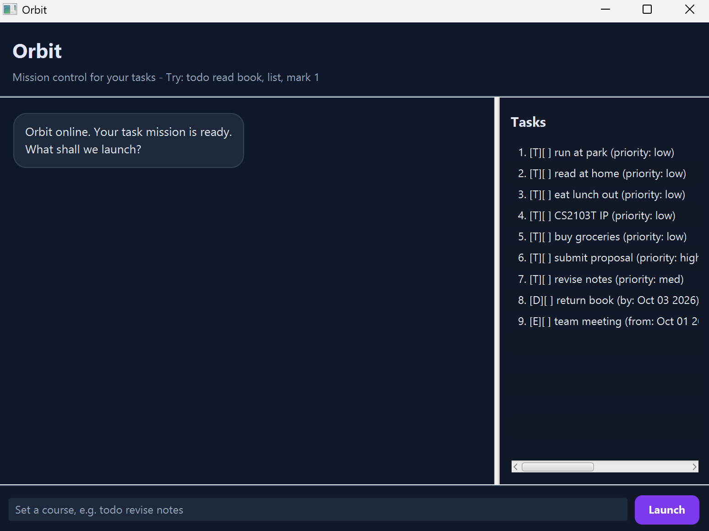

# Orbit User Guide

Orbit is a mission-control inspired desktop task companion. It helps you track to-dos, deadlines, and events in
one place, with a priority for every mission.

## Quick start

1. Open a terminal in the project folder.
2. Run `./gradlew run` in Git Bash, or `.\gradlew.bat run` in PowerShell.
3. Type a command in Orbit's command field, then press Enter or select **Launch**.

Orbit saves task data automatically, so your missions remain available the next time you open the application.

## Features

### Add a to-do

Format: `todo DESCRIPTION [/priority low|med|high]`

Example: `todo revise lecture notes /priority high`

### Add a deadline

Format: `deadline DESCRIPTION /by YYYY-MM-DD [/priority low|med|high]`

Example: `deadline submit report /by 2026-10-03 /priority high`

### Add an event

Format: `event DESCRIPTION /from YYYY-MM-DD HH:MM /to YYYY-MM-DD HH:MM [/priority low|med|high]`

Example: `event project meeting /from 2026-10-01 14:00 /to 2026-10-01 15:30 /priority med`

Use a 24-hour clock for event times. For deadlines and events, put `/priority` after all date fields.

### Priorities

Every new task has a priority. If omitted, Orbit uses `low`. Valid values are `low`, `med`, and `high`; priority
values are case-insensitive.

### List and find missions

`list` shows all saved tasks. `find KEYWORD` finds matching descriptions or an exactly matching priority.

Examples: `find project` and `find high`

Description searches are case-sensitive; priority searches are case-insensitive.

### Update or remove a mission

- `mark TASK_NUMBER` marks a task complete.
- `unmark TASK_NUMBER` makes a completed task active again.
- `delete TASK_NUMBER` permanently removes a task.

Task numbers start at 1. Use `list` to confirm a number before changing or deleting a mission.

### Exit Orbit

Enter `bye` to close the application.

## Interface tips

- Your commands appear in indigo cards on the right; Orbit responses appear on the left.
- Pink cards contain errors. Read the message, correct the command, and try again; invalid commands do not change
  tasks.
- Drag the divider or resize the window to change the space for the conversation and task panel.
